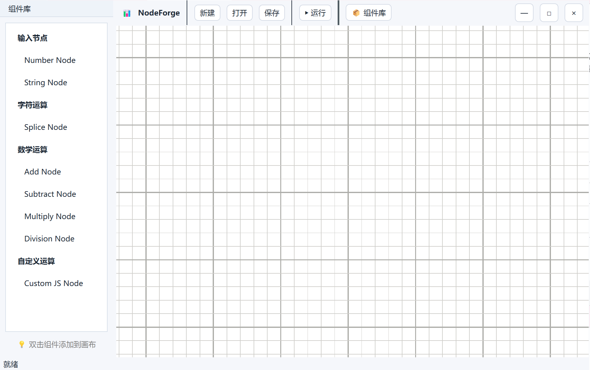
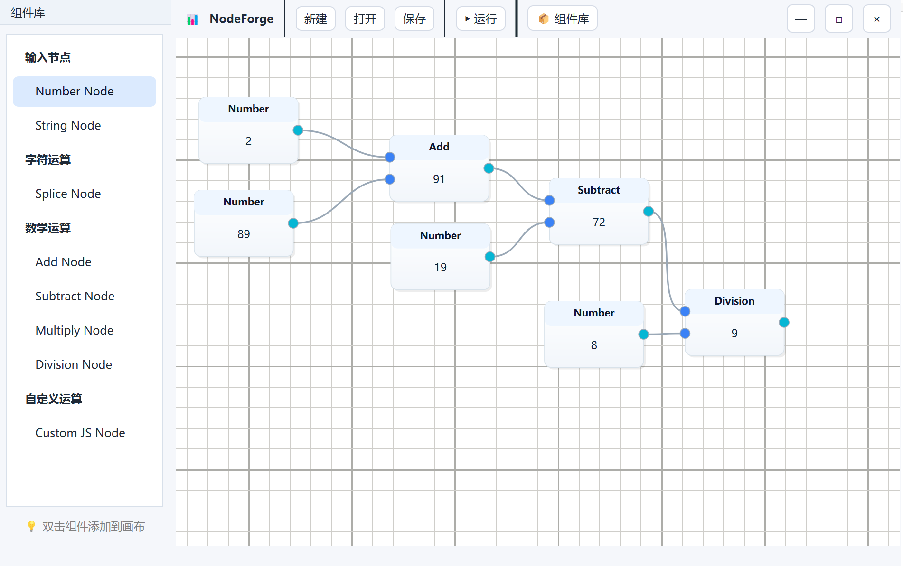

# NodeForge 🛠️

NodeForge 是一个基于 Qt/C++ 的可视化节点编辑器，允许用户通过连接不同的功能节点来创建和执行逻辑流程图。它特别适合用于原型设计、数据处理、教学演示和快速实现自定义算法。

## 📸 效果截图

*(在这里放置你的应用截图)*

|                主界面                 |             节点连接与执行             |
|:----------------------------------:|:-------------------------------:|
|              *主界面截图*               |           *节点图运行结果截图*           |
|  |  |

## ✨ 主要功能

*   **无边框界面**: 采用自定义标题栏，实现了现代化的窗口拖动、缩放和最大化/最小化功能。
*   **可视化节点编辑**:
    *   在画布上自由创建、移动和删除节点。
    *   通过拖拽端口轻松建立节点间的连接。
    *   选中节点或连接时会高亮显示。
*   **丰富的内置节点**:
    *   **输入节点**: `Number` (数值), `String` (字符串)。
    *   **数学运算**: `Add` (加法), `Subtract` (减法), `Multiply` (乘法), `Division` (除法)。
    *   **字符串操作**: `Concat` (字符串拼接)。
*   **🚀 用户自定义节点 (JavaScript)**:
    *   通过图形化对话框创建自定义节点。
    *   用户可以指定节点名称、输入/输出端口数量。
    *   使用 **JavaScript** 编写节点的核心逻辑，由内置的 `QJSEngine` 动态执行。
*   **图执行引擎**:
    *   内置拓扑排序算法，确保节点按正确的依赖顺序执行。
    *   点击 "运行" 按钮即可计算整个节点图，并在输出节点上实时显示结果。
*   **项目持久化**:
    *   支持将整个节点图（包括节点位置、连接和节点内部值）保存为 `.json` 文件。
    *   支持从 `.json` 文件加载并恢复之前的项目。
*   **交互式组件库**:
    *   侧边栏提供所有可用节点的列表。
    *   双击即可将节点添加到画布中心。

## 💻 技术栈

*   **核心框架**: C++20
*   **UI 框架**: Qt 6 (Core, Gui, Widgets)
*   **图形视图**: `QGraphicsView` / `QGraphicsScene` 框架用于绘制节点和连接。
*   **脚本引擎**: `QJSEngine` (Qt Qml 模块) 用于执行用户自定义的 JavaScript 节点。
*   **序列化**: `QJson` 用于项目文件的保存和加载。
*   **构建系统**: CMake

## 🚀 如何构建和运行

本项目使用 CMake 进行构建，并依赖 Qt 6。

1.  **环境准备**:
    *   安装支持 C++20 的编译器 (例如 MSVC 2022, GCC 11+, Clang 13+)。
    *   安装 Qt 6 (确保已安装 `Qt Widgets`, `Qt Qml` 模块)。
    *   安装 CMake。
    *   配置好你的 IDE (如 CLion, Qt Creator, Visual Studio) 的 Qt 和 CMake 环境。

2.  **构建项目**:
    *   **CLion / Qt Creator**: 直接打开项目根目录下的 `CMakeLists.txt` 文件，IDE 会自动配置项目。点击 "Build" 和 "Run" 即可。
    *   **命令行 (通用)**:
        ```bash
        # 创建构建目录
        mkdir build
        cd build

        # 配置项目 (需将 <path_to_qt> 替换为你的 Qt 安装路径)
        cmake .. -DCMAKE_PREFIX_PATH=<path_to_qt>/6.x.x/msvc2022_64

        # 构建
        cmake --build .

        # 运行 (可执行文件通常在 build/debug 或 build/release 目录下)
        ./NodeForge.exe
        ```

## 📖 如何使用

1.  **添加节点**: 从左侧 "组件库" 面板双击一个节点，它将被添加到画布中央。
2.  **移动节点**: 在节点标题栏上按住鼠标左键拖动。
3.  **连接节点**:
    *   在一个节点的输出端口（右侧）上按住鼠标左键。
    *   拖动到另一个节点的输入端口（左侧）并松开。
    *   一条连接线即被创建。
4.  **修改输入值**: 双击 "Number" 或 "String" 节点的标题，会弹出对话框让你输入新的值。
5.  **执行图**: 点击顶部工具栏的 "▶ 运行" 按钮，所有连接的节点将从左到右依次计算，最终结果会显示在末端节点的输出端口旁。
6.  **删除**:
    *   点击一个节点或一条连接线使其高亮。
    *   按下 `Delete` 键即可删除。
7.  **保存/打开**: 使用顶部工具栏的 "保存" 和 "打开" 按钮来管理你的项目文件。

## 💡 未来扩展方向

*   **更丰富的节点库**: 增加文件 I/O、网络请求、图表绘制等内置节点。
*   **界面美化**: 使用 QSS 样式表或 QML 进一步美化 UI，提供主题切换（浅色/深色）。
*   **错误处理**: 在节点执行出错时（如除以零、JS 脚本错误），在 UI 上给出明确提示。
*   **子图功能**: 允许将一组节点封装成一个“宏”节点，以简化复杂的图。
*   **性能优化**: 对于大规模节点图，优化执行和渲染性能。
